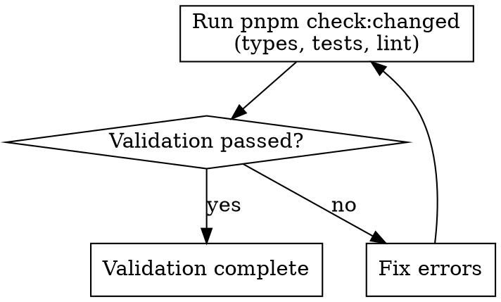

# Audit Changes

## Overview

Validation pipeline for code changes: run the changed-file validation (types + tests + lint), fix any failures until green, and stage files separately only when you need them prepared for later git operations. This is a routine task to run during development — for post-completion quality gates, use the `/quality` skill instead.

## Workflow

### Step 1: Run the Validation

1. From the project root, run: `pnpm check:changed` (your changed-file validation: lint + type-check + tests)
   - **STEP 1:** Type checking
   - **STEP 2:** Testing (run tests on changed files and their corresponding tests)
   - **STEP 3:** Linting (lint changed JS/TS files)
2. Local mode already includes staged, unstaged, and untracked script files
3. If you want files staged for a later commit, do that separately after the validation finishes

### Step 2: Fix Errors (if any)

If the validation fails at any step:
1. Read the error output carefully
2. Fix the root cause (type errors, test failures, lint violations)
3. Re-run `pnpm check:changed`
4. Repeat until the validation passes

**Do NOT skip steps or skip type checking unless the user explicitly requests it.**

## Variants

- `pnpm check:changed` — local mode (staged + unstaged + untracked script changes)
- `pnpm check:changed --full` — full branch mode (all changes since fork point, full project lint)

## Common Mistakes

- Assuming `pnpm check:changed` only checks staged files; local mode also includes unstaged and untracked script changes
- Staging files before validation to preserve a commit-ready index; local mode already validates staged, unstaged, and untracked script files without moving them between areas
