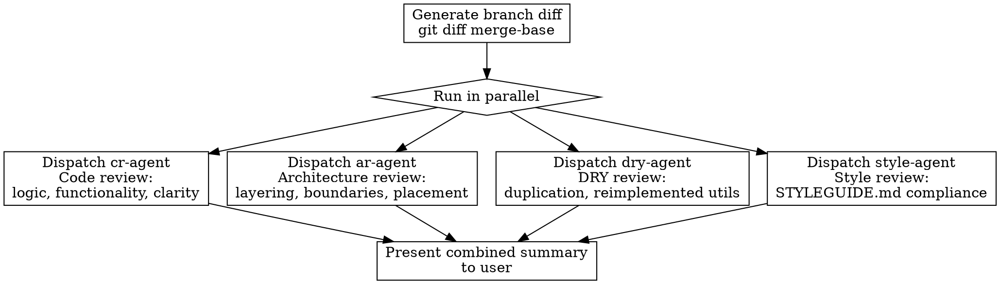

# Quality

## Overview

Post-completion quality gate that runs four reviews in parallel: code review (cr-agent), architecture review, DRY review, and style review. Use this after your implementation work is done and `/audit-changes` passes, but before merging or opening a PR.

## When to Use

- After finishing implementation and passing `/audit-changes`
- Before merging a feature branch or opening a PR
- When you want a final quality check on the full branch

**Do NOT use this during active development** — use `/audit-changes` for that. This skill is for when the work is done.

## Workflow

### Step 1: Generate Branch Diff

Get the branch diff with `git diff $(git merge-base HEAD main)...HEAD`.

Optionally group the diff by file type so all four reviews can consume it consistently.

### Step 2: Run Reviews in Parallel

Dispatch all four reviews concurrently:

**Code Review (cr-agent):**
- Dispatch the `cr-agent` via the Task tool
- It reads the diff and plan context (`plan/1-high-level-plan.md`, `plan/2-implementation-plan.md`)
- Produces prioritized findings (P0-P4) written to `plan/cr-<batch>-<n>.md` files
- Focus: logic, functionality, clarity of intent

**Architecture Review (ar-agent):**
- Dispatch the `ar-agent` via the Task tool
- It reads the diff and architecture source of truth
- Produces findings, refactoring options, and a recommendation written to `plan/architecture-review.md`
- Focus: layering, boundaries, module/feature placement

**DRY Review (dry-agent):**
- Dispatch the `dry-agent` via the Task tool
- It reads the diff and searches the full codebase for existing implementations
- Produces findings written to `plan/dry-review.md`
- Focus: duplicated logic, reimplemented utilities, copy-pasted mocks

**Style Review (style-agent):**
- Dispatch the `style-agent` via the Task tool
- It reads the diff and validates against `STYLEGUIDE.md`
- Produces findings written to `plan/style-review.md`
- Focus: JS/TS conventions, styling patterns, test practices, file organization

### Step 3: Present Combined Summary

After all four reviews complete:

1. Summarize the code review findings by priority level (how many P0, P1, P2, etc.)
2. Summarize the architecture review recommendation
3. Summarize DRY review findings (if any redundancies found)
4. Summarize style review findings by severity (how many S1, S2, S3)
5. List any **P0 or P1 issues** and **S1 style violations** that should be addressed before merge

## Common Mistakes

- Running quality checks during active development instead of after completion
- Not generating the diff first — all four reviews need it
- Addressing P3/P4 findings before P0/P1 — prioritize by severity
- Running reviews sequentially when they can be parallelized
