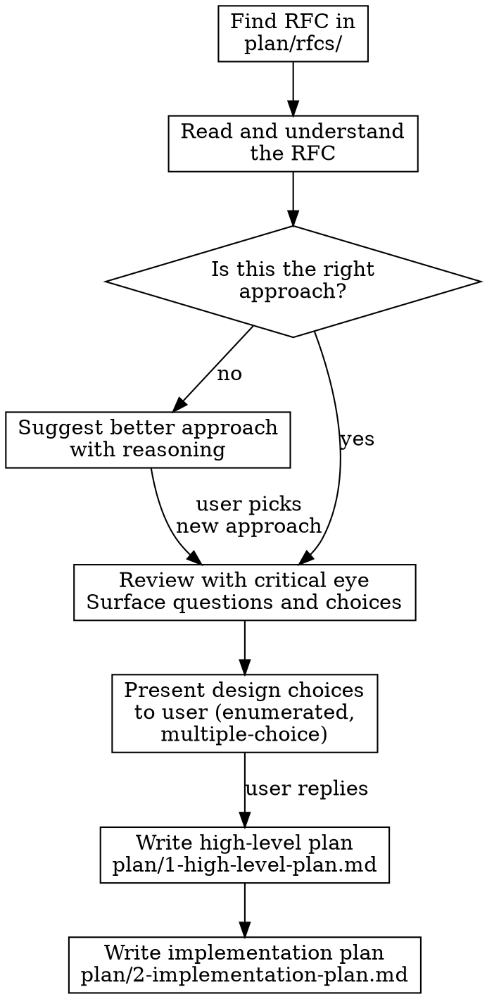

# RFC Review

## Overview

Reviews an RFC from `plan/rfcs/`, validates the approach, surfaces design questions with multiple-choice options, and produces a high-level plan and a detailed implementation plan.

## When to Use

- When starting work on a new RFC
- When an RFC needs technical review before implementation begins
- When you need to generate an implementation plan from an RFC

## Workflow



### Step 1: Find and Read the RFC

1. List files in `plan/rfcs/`
2. If the user specified an RFC by name, read that one. Otherwise, if there is only one RFC, use it. If multiple, ask the user which one.
3. If `plan/rfcs/` is empty, stop and tell the user to add an RFC there first.

### Step 2: Validate the Approach

Read the RFC thoroughly and evaluate:
- Is this the right approach for the problem described?
- Are there better alternatives?

**If the approach is wrong or suboptimal:** Stop and suggest a better approach. Explain why the alternative is superior. Wait for the user before continuing.

**If the approach is sound:** Proceed to review.

### Step 3: Critical Review and Design Questions

Review the RFC with a critical eye. Identify:
- Ambiguities or underspecified behavior
- Missing edge cases
- Architectural implications (layer boundaries, module placement)
- Performance or security concerns
- Dependencies on other systems or features

Present feedback to the user. For any questions or design choices, offer them in an **enumerated format with multiple-choice options** and your recommendation for each.

Example:
```
1. Where should the new hook live?
   a) `@app/modules/billing/hooks/` (Recommended — data fetching belongs in module hooks)
   b) `features/checkout/hooks/` (closer to usage but violates layering)
   c) `lib/hooks/` (only if truly cross-module)
```

**Wait for the user to reply before proceeding.**

### Step 4: Write the High-Level Plan

Update `plan/1-high-level-plan.md` incorporating the user's decisions. Keep it high-level and in plain English — no implementation details yet.

### Step 5: Write the Implementation Plan

Generate a detailed, standalone implementation plan at `plan/2-implementation-plan.md`. This document must be self-contained — do not refer to the RFC, past decisions, or other documents.

Follow this structure:

```
## Overview
An overview of the intended functionality and goal of this work.

## Key Requirements
Required functionality for acceptance.

## Considerations
Gotchas and things we must be aware of in this codebase. Functionality to maintain,
practices to uphold. Tests to add or update. Secondary or cascading effects and how
to address them.

## Files Involved
A file-by-file breakdown of work. Include light code samples as needed. This should
be the meatiest section. Include additions and updates to test files.

## Implementation Order
A step-by-step roadmap. Not phases or a migration plan — one shot, one TODO list.
```

Reference your architecture guide for architectural guidance when deciding file placement and layering, if it exists.

## Common Mistakes

- Skipping the approach validation — always question whether the RFC is the right path first
- Presenting design questions without concrete options — always offer enumerated choices
- Writing the implementation plan with references to "as discussed" or "per the RFC" — it must be standalone
- Jumping to implementation plan without waiting for user input on design choices
